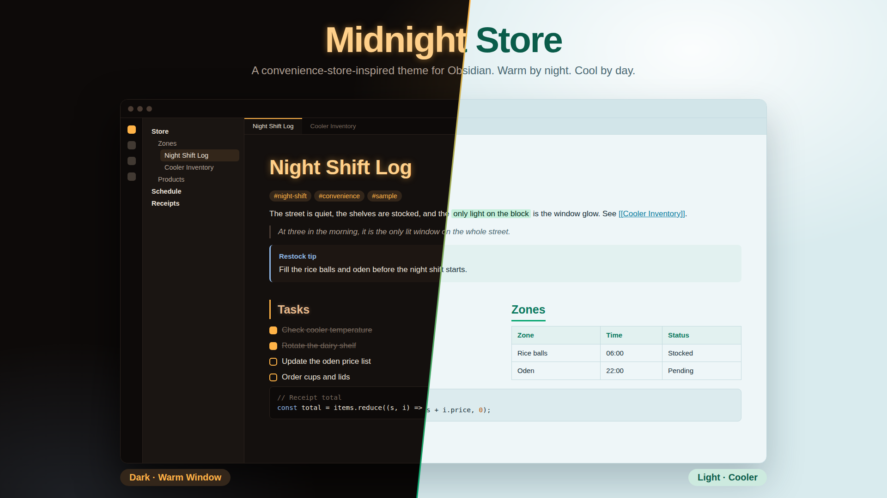

# Midnight Store

便利店美学启发的 Obsidian 主题。

> An Obsidian theme inspired by convenience-store aesthetics.

## 配色

| 模式 | 名称 | 主色 |
|------|------|------|
| Dark | 暖窗 | 琥珀 × 奶茶 (`#ffb347` × `#e6b98d`) |
| Light | 冷柜 | 薄荷 × 冰蓝 (`#00a36c` × `#0a7ea0`) |

> | Mode | Name | Palette |
> |------|------|---------|
> | Dark | Warm Window | Amber × Milk Tea |
> | Light | Cooler | Mint × Ice |

## 特色

- **Dark h1** 琥珀色辉光阴影
- **Light h2** 薄荷绿下划线
- 标签药丸形圆角
- 引用块斜体
- 圆角代码块边框

> - Dark h1 amber glow
> - Light h2 mint underline
> - Pill-shaped tags
> - Italic blockquotes
> - Bordered code blocks

## 安装

设置 → 外观 → 主题 → 管理 → 浏览社区主题，搜索 `Midnight Store`。

> Settings → Appearance → Themes → Manage → Browse community themes, search `Midnight Store`.

